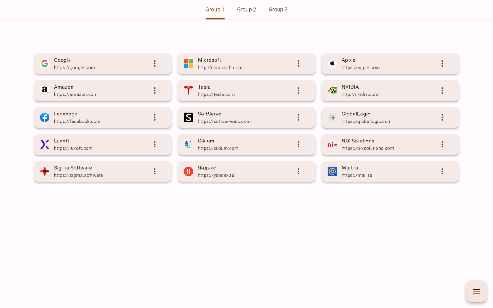
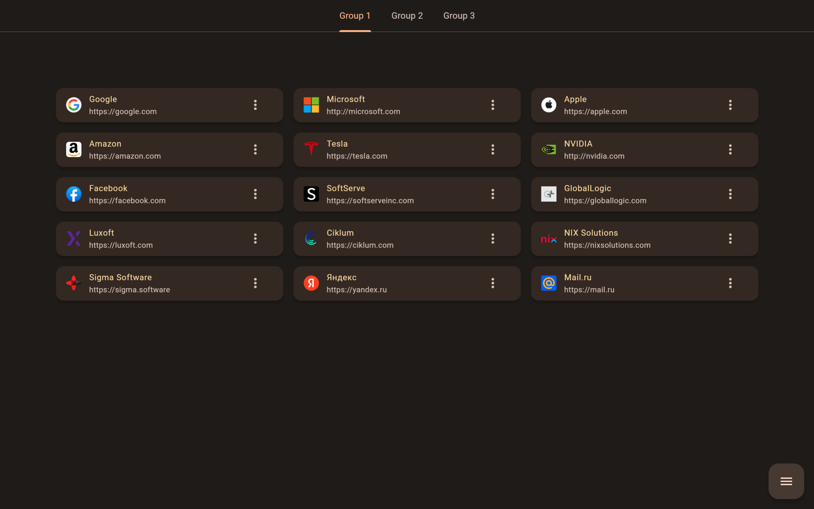
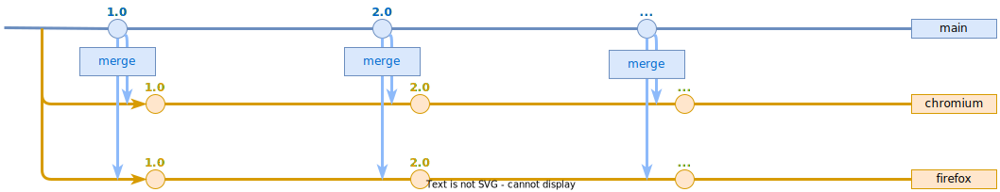

<p align="center">
  
</p>

# OnHand

Сreated for easy and convenient management of your favorite sites, which can be opened directly from a browser "new tab" page.

Neat and minimalistic.
Uses material design.

Features:
- adding bookmarks in a simple way
- grouping bookmarks using tabs
- easy data management, loading and saving to a file, without clouds and accounts
- supports switching between light and dark theme (it depends on the theme color of the operating system)

Supported by almost all popular desktop browsers in the world (except Opera): Google Chrome, Firefox, Edge, Chromium etc.

This extension is guaranteed to always be free and open source.

## Localization and internationalization

The extension is multilingual. At the moment, only three languages are implemented and supported: English, Russian and Ukrainian. Other languages can easily be added if you ask me to do so. I would be grateful for your cooperation.

For now, there is no way to dynamically switch the language. The extension will automatically launch in the language of your browser. If the browser uses a language that is not currently supported, the extension will be in English.

## Usage Notes

### How to open bookmarks

To open a bookmark in the **currently open tab**:
* just click on bookmark

To open a bookmark in a **new background tab**:
* click on bookmark while holding down the Ctrl key
* сlick on bookmark with the middle mouse button (wheel)

### Moving bookmarks and groups

It is possible to move bookmarks using only the mouse within the same group. To do this, simply hold down the left mouse button on the bookmark, and then drag the bookmark to the desired location inside the group.

The same approach is used to move groups. To do this, you need to open the dialog box from the menu item "Group management", in which groups will be able to move in the same way.

To move an existing bookmark to another group, enter the bookmark edit mode, select another group from the list of groups, and then apply the changes. The bookmark will be added to the end of the selected group.

## Publication in web stores

[Chrome Web Store](https://chrome.google.com/webstore/detail/onhand/ndghfaalceocliigojpcoohpaagomkcf)

[Mozilla Add-ons](https://addons.mozilla.org/ru/firefox/addon/onhand)

[Microsoft Edge Addons](https://microsoftedge.microsoft.com/addons/detail/onhand/kcicjmoijnmhooklndppjknpocdafoep)

## Screenshots

Light mode:<br>

<br>Dark mode:<br>


## Contributing

Contributions are what make the open source community such an amazing place to learn, inspire, and create. Any contributions you make are greatly appreciated.

To contribute:
1. Fork the project
1. Create your feature branch (git checkout -b feature/AmazingFeature)
1. Commit your changes (git commit -m 'Add some AmazingFeature')
1. Push to the branch (git push origin feature/AmazingFeature)
1. Open a Pull Request

I will be very grateful for your support.

## Branch Strategy

I would like to give a short diagram of the existing branches and the direction of the merges between these branches.



## Build

You can easily build the release version of this browser extension.
1. Please make sure you have Flutter framework installed on your computer. If it is not installed yet, download it from the [Flutter official site](https://docs.flutter.dev/get-started/install), install and configure as directed in the manual.
1. Please make sure you have Node.js installed on your computer. If it is not installed yet, download it from the [Node.js official site](https://nodejs.org) and install it.
1. To build on **Windows**: just run the file `release_build.bat` at the root of the project.<br>
Otherwise, to build on **any desktop platform**, use this list of commands:
    ```properties
    flutter clean
    flutter pub get
    flutter build web --web-renderer html --csp
    npm install
    node post-harmonization.js
    node post-packaging.js
    ```
1. The package with the necessary files should be on the `/build/package` folder.
