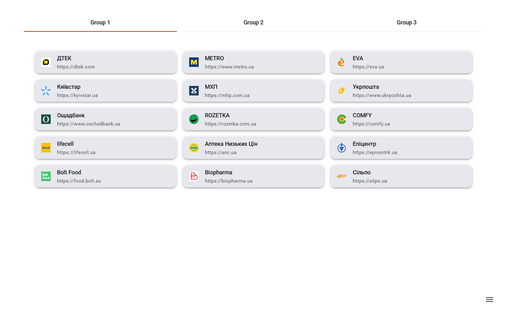
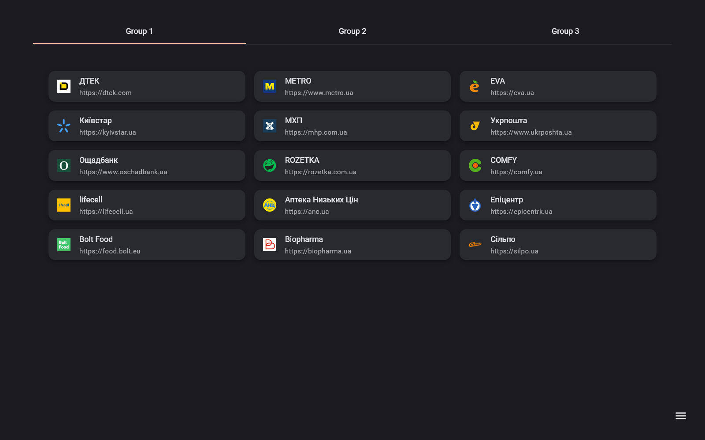

<p align="center">
  
</p>

# OnHand: Your Personalized New Tab for Effortless Bookmark Management

OnHand is a lightweight and elegant browser extension designed to transform your new tab page into a central hub for your favorite websites. Say goodbye to scattered bookmarks and embrace a clean, intuitive way to access your digital world directly from where you start browsing.

Crafted with a minimalist aesthetic and leveraging Material Design principles, OnHand offers a seamless and visually pleasing experience. It's built for those who value simplicity, efficiency, and privacy.

## ✨ Features That Make Browsing Smoother

- **Effortless Bookmark Management:** Add and organize your favorite sites with unparalleled ease.
- **Tab-Based Grouping:** Keep your bookmarks neatly categorized using intuitive groups organized as tabs, decluttering your digital space.
- **Private Data Control:** Your data stays yours. Easily load and save your bookmarks to a local file, ensuring full control without relying on clouds or accounts.
- **System Theme Sync:** Enjoy a comfortable viewing experience with automatic light and dark theme switching that respects your operating system's preferences.

OnHand is a free and open-source project, committed to empowering users without hidden costs or data compromises.

## 🚀 Get OnHand Today!

OnHand is widely supported across popular desktop browsers, bringing streamlined bookmark management to your fingertips. (Note: Currently not oficially supported on Opera.)

Find OnHand in your preferred browser's official store:

- [Chrome Web Store](https://chrome.google.com/webstore/detail/onhand/ndghfaalceocliigojpcoohpaagomkcf)
- [Mozilla Add-ons](https://addons.mozilla.org/ru/firefox/addon/onhand)
- [Microsoft Edge Addons](https://microsoftedge.microsoft.com/addons/detail/onhand/kcicjmoijnmhooklndppjknpocdafoep)

## 🌐 Multilingual Support

OnHand speaks your language! The extension is fully multilingual, currently supporting English, Russian, and Ukrainian. We're always open to expanding our linguistic reach – if you'd like to contribute another language, please reach out!

**Important Note on Language:** OnHand automatically detects and uses your browser's language. If your browser's language isn't yet supported, it will default to English. There's currently no in-app option for dynamic language switching.

## 📖 How to Use OnHand

Mastering OnHand is simple. Here are the key interactions:

### Opening Bookmarks

- **In the Current Tab:** Just a single click on any bookmark.
- **In a New Background Tab:**
  - Hold down the `Ctrl` key while clicking the bookmark.
  - Click the bookmark with your middle mouse button (scroll wheel).

### Organizing Bookmarks and Groups

- **Moving Bookmarks within a Group:** Click and drag a bookmark with your left mouse button to rearrange it within its current group.
- **Moving Groups:** Access the "Group management" dialog from the menu. Within this dialog, you can click and drag groups to reorder them in the same intuitive way.
- **Moving a Bookmark to a Different Group:**
  1.  Enter the bookmark's edit mode.
  2.  Select the desired new group from the dropdown list.
  3.  Apply the changes. The bookmark will then appear at the end of the selected group.

## 📸 See OnHand in Action

Visual learner? Check out OnHand's sleek interface in both light and dark modes:

<p align="center">
  <h3>Light Mode</h3>
  
  <h3>Dark Mode</h3>
  
</p>

## 🤝 Contribute to OnHand

Your contributions are what make open-source projects thrive! Whether it's adding a feature, fixing a bug, or improving documentation, every bit of help is truly appreciated.

To get involved:

1.  **Fork** this repository.
2.  Create your feature branch: `git checkout -b feature/your-awesome-feature`.
3.  **Commit** your changes: `git commit -m 'feat: Add a brilliant new feature'`. (Consider conventional commits for better history!)
4.  **Push** to the branch: `git push origin feature/your-awesome-feature`.
5.  Open a **Pull Request** and describe your changes.

Thank you for considering contributing!

## 🛠️ Build OnHand from Source

Want to dive deeper, create your own customized version, or simply understand how OnHand works under the hood? Building the extension from its source code is a straightforward process. Here’s how to compile your own ready-to-use extension package.

### What You'll Need

Before you begin, make sure you have these essentials:

- **Git:** You'll need Git to clone the project's source code. If you don't have it installed, you can download it from [git-scm.com](https://git-scm.com/downloads).
- **Node.js:** OnHand uses Node.js and its package manager, `npm`, for managing dependencies and running build scripts. Install the recommended LTS version from the [Node.js official site](https://nodejs.org). Installing Node.js will automatically set up `npm` for you.

### Step-by-Step Build Guide

Follow these steps to compile your own OnHand release package:

1.  **Get the Source Code:**
    First, clone the OnHand repository to your local machine. Open your terminal or command prompt and execute:

    ```bash
    git clone https://github.com/yegor-pelykh/OnHand.git
    cd OnHand
    ```

2.  **Install Project Dependencies:**
    Navigate into the `OnHand` project directory (if you're not already there) and install all the required libraries and tools:

    ```bash
    npm install
    ```

    This command fetches all the necessary components OnHand needs to build and run correctly.

3.  **Create Your Release Package:**
    Now, let's build the ready-to-distribute `.zip` file. Run the packaging script:

    ```bash
    npm run pack
    ```

    During this process, the script will ask you to select the target browser. Choose `Firefox` if you're building for Firefox, or `Other Browsers` (which typically covers Chromium-based browsers like Chrome, Edge, Brave, Vivaldi, etc.) for other platforms. This selection ensures the package is optimized for its intended browser environment. This single command handles both compiling the project and compressing it into a `.zip` archive.

4.  **Locate Your Compiled Extension:**
    After the build process finishes, your newly created OnHand extension package will be available. You'll find the `.zip` file inside the `/package` folder at the root of your project directory.

### Testing Your Build (Optional)

Once you've built your package, you can easily load it into your browser for testing or personal use without going through an app store.

- **For Chromium-based Browsers (Chrome, Edge, Brave, Vivaldi, etc.):**
  1.  Open your browser and navigate to `chrome://extensions` (or `edge://extensions`, etc.) in the address bar.
  2.  Toggle on "Developer mode," usually located in the top right corner.
  3.  You'll need an _unpacked_ version to load. First, locate the `.zip` file generated in your `/package` folder and manually unzip it to a new directory.
  4.  Click the "Load unpacked" button, then select the directory you just unzipped (this directory should contain `manifest.json` and other extension files).

- **For Mozilla Firefox:**
  1.  Open Firefox and type `about:debugging#/runtime/this-firefox` into the address bar.
  2.  You'll need an _unpacked_ version to load. First, locate the `.zip` file generated in your `/package` folder and manually unzip it to a new directory.
  3.  Click the "Load Temporary Add-on..." button, then select `manifest.json` from the directory you just unzipped. Firefox will load it for the current session.

## 📜 License

OnHand is distributed under the MIT License. See the [LICENSE](LICENSE) file for more information.

## ❓ Questions or Feedback?

Have a question, suggestion, or encountered an issue? Feel free to open an issue on GitHub or reach out to the maintainer. We'd love to hear from you!
