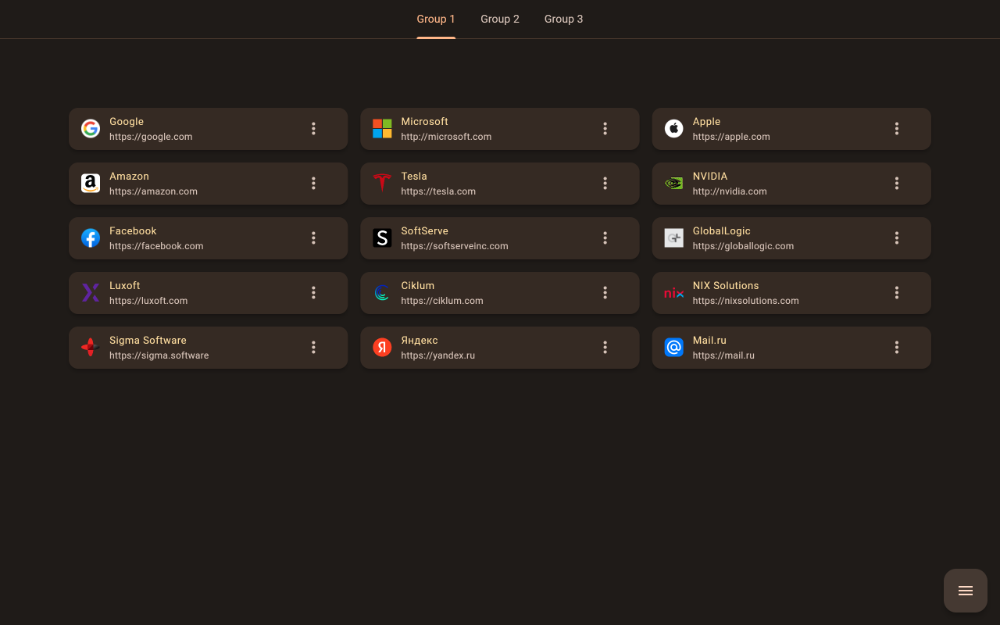

<p align="center">
  
</p>

# OnHand

Сreated for easy and convenient management of your favorite sites, which can be opened directly from a browser "new tab" page.

Neat and minimalistic.
Uses material design.

Features:
- adding bookmarks in a simple way
- grouping bookmarks using tabs
- easy data management, loading and saving to a file, without clouds and accounts
- supports switching between light and dark theme (it depends on the theme color of the operating system)
- can be run in any browser that supports WebExtension API, such as:
  * Google Chrome
  * Opera
  * Firefox
  * Edge
  * Chromium
  * etc.

Currently, there are such restrictions on the use of this add-on:
- only English interface language is supported
- this addon was made only for desktop browsers

## Publication in stores

[Chrome Web Store](https://chrome.google.com/webstore/detail/onhand/ndghfaalceocliigojpcoohpaagomkcf)

[Mozilla Add-ons](https://addons.mozilla.org/ru/firefox/addon/onhand)

[Microsoft Edge Addons](https://microsoftedge.microsoft.com/addons/detail/onhand/kcicjmoijnmhooklndppjknpocdafoep)

## Usage Notes

> **How to open bookmarks**
> 
> By clicking on a bookmark, the website will be opened in the same tab by default.<br/>
> But if you hold down the Ctrl key and then click on the bookmark, the browser will open the website in a new background tab.

## Screenshots

Light mode:<br>

<br>Dark mode:<br>


## Contributing

Contributions are what make the open source community such an amazing place to learn, inspire, and create. Any contributions you make are greatly appreciated.

To contribute:
1. Fork the project
1. Create your feature branch (git checkout -b feature/AmazingFeature)
1. Commit your changes (git commit -m 'Add some AmazingFeature')
1. Push to the branch (git push origin feature/AmazingFeature)
1. Open a Pull Request

I will be very grateful for your support.

## Branch Strategy

I would like to give a short diagram of the existing branches and the direction of the merges between these branches.


## Build

You can easily build the release version of this browser extension.
1. Please make sure you have Node.js installed on your computer. If it is not installed yet, download it from the [Node.js official site](https://nodejs.org) and install it.
2. To build on **Windows**: just run the file `release_build.bat` at the root of the project.<br>
Otherwise, to build on **any desktop platform**, use this list of commands:
    ```properties
    flutter clean
    flutter pub get
    flutter build web --web-renderer html --csp
    npm install
    node harmonization.js
    ```